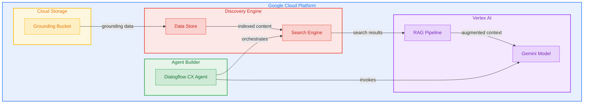

# Terraform GCP Gemini Platform

Terraform module for deploying Vertex AI Generative AI for Gemini on Google Cloud Platform, including grounding, RAG (Retrieval-Augmented Generation), and Agent Builder capabilities.

## Architecture



## Features

- Discovery Engine Data Store for structured and unstructured data ingestion
- Discovery Engine Search Engine with enterprise-tier LLM add-ons
- Dialogflow CX Agent for conversational AI with Agent Builder
- Cloud Storage bucket for grounding data with versioning support
- Configurable industry verticals and content configurations
- Comprehensive labeling and IAM support

## Usage

### Basic

```hcl
module "gemini_platform" {
  source = "github.com/kogunlowo123/terraform-gcp-gemini-platform"

  project_id = "my-gcp-project"
  region     = "us-central1"

  data_store_id          = "my-data-store"
  search_engine_id       = "my-search-engine"
  grounding_bucket_name  = "my-project-gemini-grounding"

  enable_dialogflow_agent = false
}
```

### Complete

```hcl
module "gemini_platform" {
  source = "github.com/kogunlowo123/terraform-gcp-gemini-platform"

  project_id = "my-gcp-project"
  region     = "us-central1"

  data_store_id                = "my-data-store"
  data_store_display_name      = "Production Data Store"
  data_store_industry_vertical = "GENERIC"

  search_engine_id          = "my-search-engine"
  search_engine_display_name = "Production Search"

  grounding_bucket_name     = "my-project-gemini-grounding"
  grounding_bucket_location = "US"

  enable_dialogflow_agent           = true
  dialogflow_agent_display_name     = "Production Agent"
  dialogflow_agent_time_zone        = "America/New_York"

  labels = {
    environment = "production"
    team        = "ai-platform"
  }
}
```

## Requirements

| Name | Version |
|------|---------|
| terraform | >= 1.5.0 |
| google | >= 5.10.0 |
| google-beta | >= 5.10.0 |

## Inputs

| Name | Description | Type | Default | Required |
|------|-------------|------|---------|:--------:|
| project\_id | The GCP project ID | `string` | n/a | yes |
| region | The GCP region for resources | `string` | `"us-central1"` | no |
| data\_store\_id | The ID of the Discovery Engine data store | `string` | n/a | yes |
| search\_engine\_id | The ID of the Discovery Engine search engine | `string` | n/a | yes |
| grounding\_bucket\_name | Name of the Cloud Storage bucket for grounding data | `string` | n/a | yes |
| enable\_dialogflow\_agent | Whether to create the Dialogflow CX agent | `bool` | `true` | no |
| labels | Labels to apply to all resources | `map(string)` | `{}` | no |

## Outputs

| Name | Description |
|------|-------------|
| data\_store\_id | The ID of the Discovery Engine data store |
| search\_engine\_id | The ID of the Discovery Engine search engine |
| dialogflow\_agent\_id | The ID of the Dialogflow CX agent |
| grounding\_bucket\_name | The name of the Cloud Storage grounding bucket |
| grounding\_bucket\_url | The URL of the Cloud Storage grounding bucket |

## License

MIT Licensed. See [LICENSE](LICENSE) for full details.
